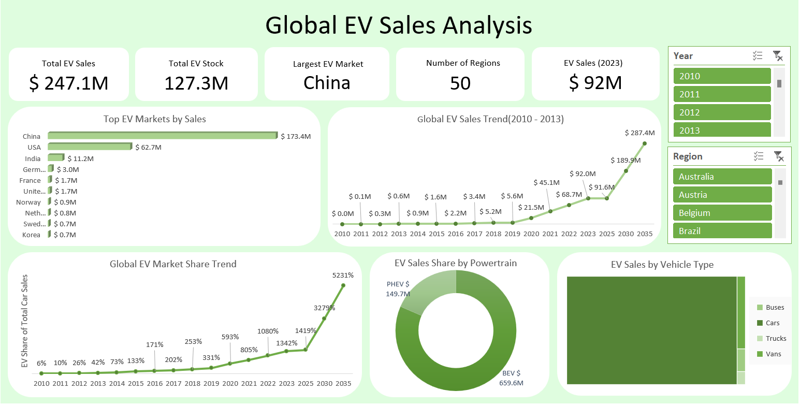

# ⚡ Global Electric Vehicle Sales Analysis & Interactive Excel Dashboard

## 🔍 Project Overview
This project focuses on analyzing **global electric vehicle (EV) market trends** using **Microsoft Excel**.  
The objective was to analyze EV adoption patterns across different **countries, vehicle types, and powertrain technologies**, identify leading EV markets, and understand the growth of the global EV industry over time.

The project involved **data analysis using Pivot Tables, KPI generation, and building an interactive dashboard** to visualize EV market performance and adoption trends.

All analysis and visualization were completed using **advanced Excel features without external BI tools**.

---

## 🧠 Business Objective
The goal of this project was to:

- Identify **which countries dominate the global EV market**
- Analyze **growth trends in EV adoption over time**
- Compare **EV technology adoption (BEV vs PHEV)**
- Understand **EV sales distribution across vehicle types**
- Analyze **global EV market expansion across regions**
- Build a **dynamic dashboard for EV market monitoring**

---

## 🛠 Tools & Features Used
- Microsoft Excel
- Data Cleaning & Preparation
- Pivot Tables
- Pivot Charts
- KPI Calculations
- Slicers & Filters
- Donut Chart
- TreeMap Chart
- Column & Bar Charts
- Line Charts for Trend Analysis
- Dashboard Design & Layouting

---

## 📂 Dataset Overview
The dataset used in this project contains global EV market data including:

- EV Sales
- EV Stock (total EVs on road)
- EV Sales Share
- Powertrain Type (BEV, PHEV)
- Vehicle Mode (Cars, Vans, Buses, Trucks)
- Region / Country
- Year-based EV market data

This dataset enables analysis of **global EV adoption trends, technology preferences, vehicle segment distribution, and regional market leadership**.

🔗 Dataset Source:  
The dataset was obtained from **Kaggle and originally sourced from the International Energy Agency (IEA) Global EV Data repository**, which provides comprehensive EV market statistics worldwide.

---

## 📂 Project Workflow

### 1️⃣ Data Collection
- The dataset was downloaded from **Kaggle's Global EV Sales dataset**.
- It contains EV adoption data across multiple countries and years.

### 2️⃣ Data Cleaning
- Filtered relevant parameters such as **EV Sales, EV Stock, and EV Sales Share**
- Removed forecast years to focus on **historical EV adoption trends (2010–2023)**
- Verified numerical fields and ensured proper data formatting
- Organized dataset for efficient pivot-based analysis

### 3️⃣ Data Analysis
Using Pivot Tables, the following analyses were performed:

- Global EV Sales Trend Analysis
- Top EV Markets by Total Sales
- EV Technology Distribution (BEV vs PHEV)
- Global EV Market Share Trend
- EV Sales Distribution by Vehicle Type
- Regional EV Market Comparison

### 4️⃣ KPI Creation
The following key metrics were calculated for the dashboard:

- **Total EV Sales:** 247M EVs
- **Total EV Stock:** 127M EVs
- **Largest EV Market:** China
- **Number of Regions Analyzed:** 50
- **Latest Year EV Sales:** 92M (2023)

These KPIs provide a quick overview of **global EV market growth and adoption**.

### 5️⃣ Dashboard Development
An interactive Excel dashboard was created featuring:

- KPI summary cards
- Line chart for global EV sales growth
- Bar chart for top EV markets
- Donut chart for EV powertrain distribution
- TreeMap chart for EV sales by vehicle type
- Line chart for global EV market share trend
- Interactive slicers for filtering by **year and region**

---

## 📸 Dashboard Preview

---

## 📊 Key Insights
- Global EV sales have grown **exponentially since 2010**, showing rapid adoption of electric mobility.
- **China dominates the EV market**, contributing the largest share of global EV sales.
- **Battery Electric Vehicles (BEVs)** significantly outperform Plug-in Hybrid Vehicles (PHEVs) in market share.
- Passenger **cars represent the majority of EV sales**, while buses, trucks, and vans contribute smaller shares.
- The global EV market has experienced **strong acceleration after 2019**, indicating increasing electrification of transportation.

---

## 🚀 Business Impact
This dashboard enables:

- Quick monitoring of global EV market growth
- Identification of leading EV markets worldwide
- Understanding of technology adoption trends (BEV vs PHEV)
- Insights into vehicle segment electrification
- Data-driven insights for policymakers, automotive companies, and investors

---

## 🔮 Future Improvements
Possible improvements for this project include:

- Implementing **EV sales forecasting models**
- Automating data updates using **Power Query**
- Building an advanced **Power BI dashboard**
- Adding **year-over-year EV growth analysis**
- Including **EV charging infrastructure analysis**

---

## 📌 Conclusion
This project demonstrates practical skills in **Excel-based data analysis and dashboard development**.  
It highlights the ability to transform raw EV market data into **interactive visual insights** that help understand global electric vehicle adoption and market trends.

---

## Author
**Bhavesh Lambar**

Aspiring Data Analyst | Data Science Enthusiast
